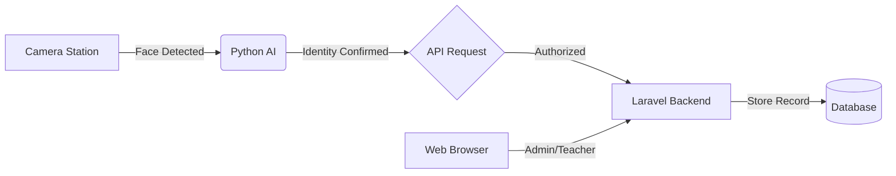

# 🤖 Smart Attendance System

[](https://laravel.com)
[](https://python.org)
[](https://opencv.org)

A sophisticated **Real-Time Face Recognition Attendance System** that bridges a **Laravel** management portal with a **Python-powered AI** recognition engine.

---

## 🌟 Key Features

### 🏢 Laravel Web Portal
- **Admin Dashboard**: Full control over teachers, students, and classes.
- **Teacher Dashboard**: Manage attendance records for assigned classes.
- **Real-Time Notifications**: Instant updates when a student is recognized.
- **Reporting System**: Detailed attendance logs with filtering and export capabilities.
- **API Key Management**: Secure communication interface for the AI stations.

### 🧠 Python AI Engine
- **Face Encoding**: Converts student photos into 128-d facial embeddings.
- **Real-Time Recognition**: High-speed identification via camera feed.
- **Anti-Spam Logic**: Built-in cooldowns and daily reset tracking to prevent duplicate logs.
- **Visual Overlay**: Real-time bounding boxes with identification confidence percentages.

---

## 🏗️ Architecture

The system uses a hybrid architecture to combine the robustness of web management with the performance of local AI processing.



---

## 📂 Project Structure

- `app/`: Core Laravel application logic (Models, Controllers).
- `routes/api.php`: The REST interface for the AI engine.
- `python-ai/`: 
  - `recognize.py`: The main recognition loop.
  - `encode_faces.py`: Training script for new student photos.
  - `dataset/`: Storage for raw student images.
  - `encodings/`: Serialized facial encoding data.

---

## 🚀 Getting Started

### 1. Requirements
- **PHP 8.2+** & **Composer**
- **Python 3.10+** (with `dlib`, `opencv-python`, and `face_recognition`)
- **MySQL** or **PostgreSQL**

### 2. Backend Setup
```bash
composer install
cp .env.example .env
php artisan key:generate
php artisan migrate --seed
php artisan serve
```

### 3. AI Engine Setup
```bash
cd python-ai
# Create a virtual environment
python -m venv venv
source venv/bin/activate  # Linux/Mac

# Install dependencies
pip install -r requirements.txt

# Run encoding (after adding photos to dataset/)
python encode_faces.py

# Start recognition
python recognize.py
```

---

## 🛠️ Technical Stack

- **Backend**: Laravel 11.x, MySQL
- **AI/ML**: Python, OpenCV, Face Recognition (dlib)
- **Security**: API Key Auth + Throttling
- **Frontend**: Blade, Vanilla CSS (Tailwind/Vite)

---

## 📝 License

Distributed under the MIT License. See `LICENSE` for more information.
